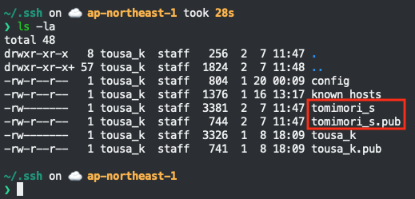

# 社内Git勉強会

## 勉強会のゴール

- 基本的なgitの操作に慣れる
- 実際に文言修正pull requestを投げられるようにする

TODO: 井上くんに「なんすか？めんどくさいっす自分で直してください」って言われなくなるみたいないらすと屋の画像を作る

## 対象者

- ソフトウェア開発のPM
- 駆け出しエンジニア

## 必要なもの

* [VSCode](https://azure.microsoft.com/ja-jp/products/visual-studio-code/)

コマンドラインでやりたい人は `terminal` に `git` を入れてください。

今一番ポピュラーなテキストエディタは ~`vim`~ `VSCode` なので入れとけばいいと思います。

他のGitクライアント使っても同じことができます。

* [SourceTree](https://www.sourcetreeapp.com/)
* [GitHub Desktop](https://desktop.github.com/)
* [Git Kraken](https://www.gitkraken.com/download/mac)

今回はVSCodeのGitの機能を使おうと思います。

## そもそもGitってなんなの？

難しく言うと、分散型レポジトリシステム。

簡単に言うと、複数人でできるバージョン管理システム。

## 抑えとくべき用語/コマンド

最低限これさえあればなんとかなる。

### 用語

1. レポジトリ ...
2. ローカル ... 自分のPCのこと
3. ブランチ ...
4. チェックアウト ...
5. コマンドライン ... 黒い画面の文字列しかないやつ

### 基本

1. `git clone` ... レポジトリをローカルにダウンロードしてくる
2. `git status` ... 自分が変更したファイルが見れる
3. `git add` ... 自分が変更したファイルを
4. `git commit` ... `add` で選択したファイルにコメントを付けて保存
5. `git push` ... ローカルにある最新の情報をGitHubにアップロードする
6. `git pull` ... GitHub上にあるレポジトリの最新の情報を取ってくる

### ブランチ操作

1. `git branch` ... ブランチの操作をする
2. `git checkout` ... ブランチを切り替える


## gitコマンドを入れて、ssh keyをGitHubに登録する
### コマンドの導入

```
$ /usr/bin/ruby -e "$(curl -fsSL https://raw.githubusercontent.com/Homebrew/install/master/install)"
$ brew install git
$ git --version
git version 2.25.0
```

### ssh keyを作成する

```
# ~/.ssh = ssh関連のファイルは原則ここに入れる
$ mkdir ~/.ssh
$ cd ~/.ssh
# ssh_keygen = ssh keyを生成するコマンド
# `tomimori_s`は自分の名前に変更
$ ssh-keygen -t rsa -b 4096 -C "tomimori_s@uuum.jp" -f tomimori_s
# コマンドを叩いた後にパスフレーズを2回聞かれるので入力します(画面には入力している内容は出ない)
# パスフレーズは空でもOK
$ ls -la
-rw-------   1 tousa_k  staff  3381  2  7 11:47 tomimori_s
-rw-r--r--   1 tousa_k  staff   744  2  7 11:47 tomimori_s.pub
```
ssh-keygenコマンドを叩いた直後。パスフレーズ1回目を聞かれる。


もう一度同じパスフレーズを入力。


ssh keyが作られたところ。


lsコマンドで中身を確認して`tomimori_s`と`tomimori_s.pub`ができていれば成功



### 作成したssh keyをGitHubに登録する

GitHub右上のメニューから`Settings`を選択


`SSH and GPG keys`を選択


`New SSH Key`を選択


ここで一度ターミナルに戻って、コマンドを叩く。
※`tomimori_s`ではなく、`tomimori_s.pub`であることに注意

```
$ cat ~/.ssh/tomimori_s.pub | pbcopy
```


GitHubに戻って貼り付けてから`Add SSH KEY`をクリック。タイトルは空でもOK。


元の画面に戻って、画像のように追加されていればOK。


# GitHubと通信できるか確認する

```
$ curl -O
```

## まずはレポジトリをcloneする

[このレポジトリ](https://github.com/UUUM/git-study) をクローンする

```
$ cd ~/Desktop
$ git clone git@github.com:UUUM/git-study.git
$ cd git-study
```

VSCodeでクローンした `UUUM/git-study` を開いてみる。

## issueを立ててみる

url: [https://github.com/UUUM/git-study/issues](https://github.com/UUUM/git-study/issues)

先に立ててみた


## branchを切ってみる
### VSCodeの場合


### コマンドラインでやる場合

```
# 01.mdを更新したい場合
$ git branch
* master
$ git checkout -b feature/update-01_md
Switched to a new branch 'feature/update-01_md'
$ git br
* feature/update-01_md
  master
```

## 作業をする

issueで割り当てられたファイルを適当に編集してみる。

## commitしてpushをする

### VSCodeの場合


### コマンドラインでやる場合

`01.md` のファイルを編集した場合こういう表示になる
```
$ git status
On branch master
Your branch is ahead of 'origin/master' by 1 commit.
  (use "git push" to publish your local commits)

Changes not staged for commit:
  (use "git add <file>..." to update what will be committed)
  (use "git restore <file>..." to discard changes in working directory)
    modified:   01.md

no changes added to commit (use "git add" and/or "git commit -a")


$ git add 01.md
$ git commit -m "ここにコミットメッセージを書く"
$ git push origin HEAD
```

## pull requestを作り、mergeしてみる


## masterを最新にする

### VSCodeの場合


### コマンドラインでやるなら
```
$ git branch
* feature/add-01
  master
$ git checkout maser
$ git pull
```

## 参考記事

- [GitHubで共同開発のためのチュートリアル](https://qiita.com/takeokunn/items/5bc499121a21f8c5b990)
- [サルでもわかるGit入門](https://backlog.com/ja/git-tutorial/)
